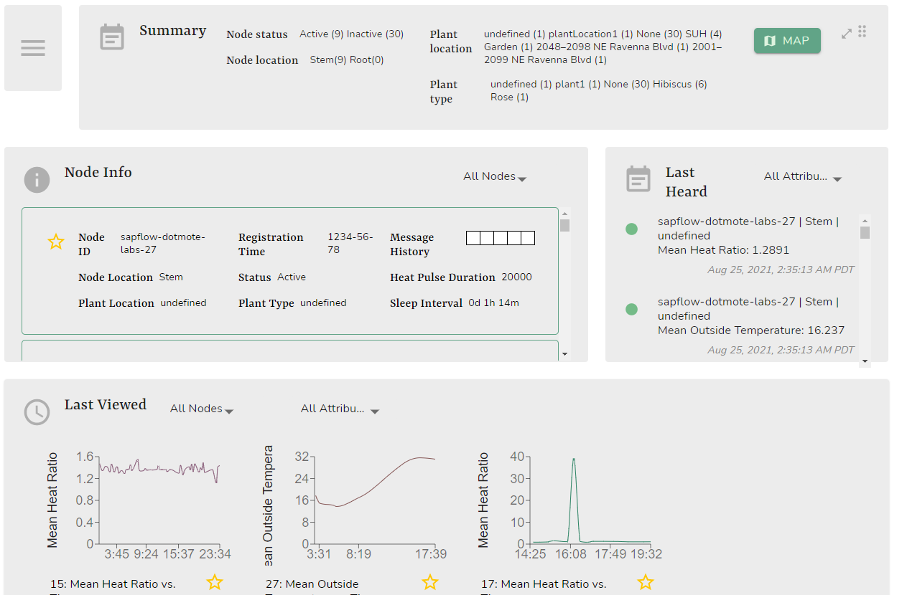
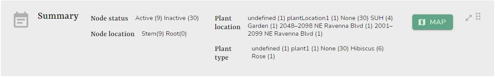
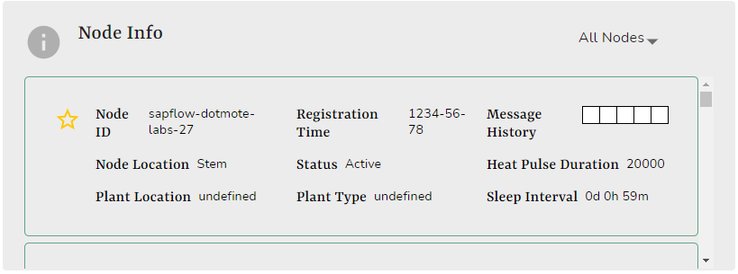
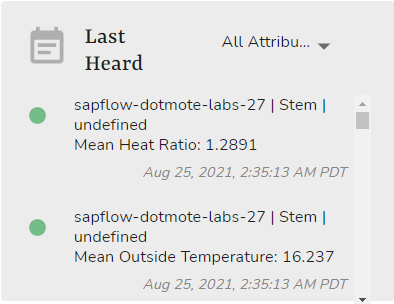
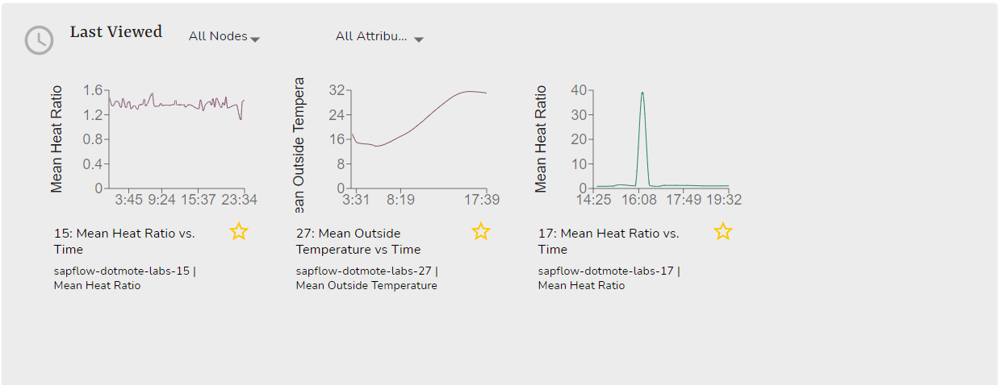

# Dashboard

The dashboard provides an overview of your nodes and graphs at a glance. You can navigate to the dashboard through the navigation bar at the top of the screen after you log in.

## Widgets

### Summary

The `Summary` widget provides a numerical overview of all node properties. 

Information shown includes:

- Node status: Displays the number of active or inactive nodes.
- Plant location: Displays the number of nodes in each plant location.
- Node location: Displays the number of nodes in each node location.
- Plant type: Displays the number of nodes with each plant type.

### Node Info

The `Node Info` widget provides an overview of individual node info. Clicking on any node will direct you to the details page of that node. 

Information shown includes:

- Node ID
- Registration time
- Message history
- Node location
- Status
- Heat pulse duration
- Plant location
- Plant type
- Sleep interval

### Last Heard

The `Last Heard` widget provides the last heard values of attributes from individual nodes. 

Information shown includes:

- Node ID
- Node location
- Plant location
- Attribute
- Last heard timestamp

### Last Viewed

The `Last Viewed` widget provides thumbnails and shortcuts to your last viewed graphs. Click on any graph to be directed to a more detailed view of the graph.

Information shown includes:

- Graph
- Graph title
- Node ids
- Attribute
- Favorite status