# Graphs

The Graphs page displays all of your graphs. Here, you can create, edit, and delete graphs.

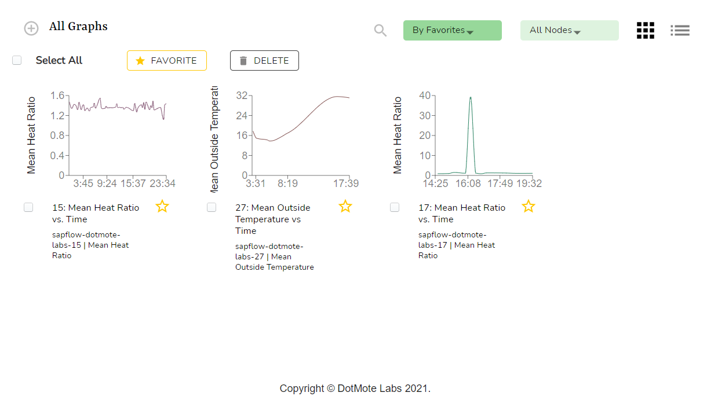

### Creating a Graph

To create a graph comparing a single attribute among multiple nodes:

1. From the Graphs page, click the `+` near the top left corner of your screen.
   This popup will appear:
   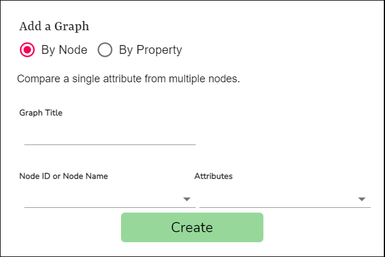
   
2. Select `By Node` under `Add a Graph`.

3. Enter a `Graph Title`.

4. Select the node ids of the nodes you want to compare.

5. Select the node attribute you would like to compare.

6. Click `Create`.

   

To create a graph comparing a single attribute among multiple nodes with the same properties:

1. From the Graphs page, click the `+` near the top left corner of your screen.

2. Select `By Property` under `Add a Graph`.
   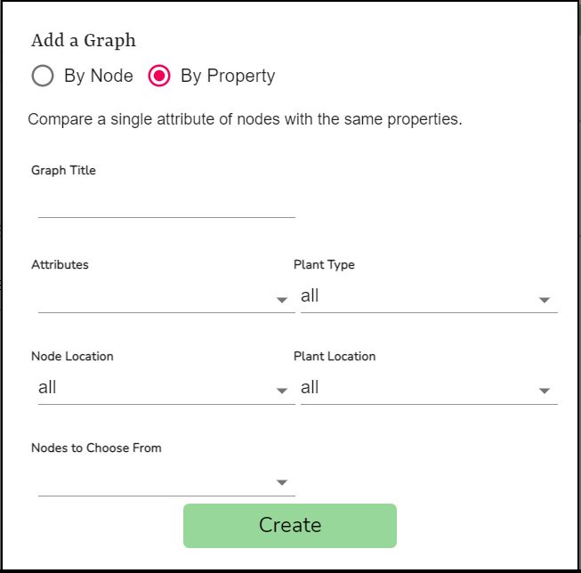

3. Enter a `Graph Title`.

4. Select the node attribute you would like to compare.

5. Select the `Plant Type` you would like your nodes to have.

6. Select the `Node Location` you would like your nodes to have.

7. Select the `Plant Location` you would like your nodes to have.

8. Select the node ids of the nodes you want to compare.

9. Click `Create`.

   

A newly created graph will display 24 hours worth of data with graph lines of different colors. You are able to change these values by editing the graph.

### Editing a Graph

Click the graph you would like to edit. You will be redirected to a page that lets you to reconfigure your graph. 

Features of this include:

- Favorite/unfavorite the graph
- Add annotations to the graph
- Delete the graph
- Modify specific properties of the graph

The following properties can be modified:
- Graph title
- Node(s) being compared
- Attribute(s) being compared
- Date range of the data
- X axis range
- Y axis range
- Annotations
- Graph colors
- Graph type
  - Line graph
  - Bar graph
  - Scatter plot
- Tags

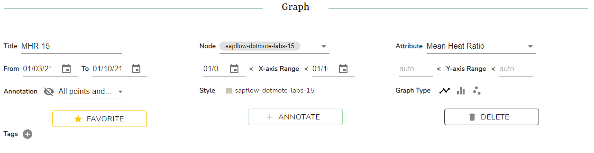

### Annotating a Graph

1. Click the graph you would like to annotate. You will be redirected to a page that lets you to annotate your graph. 

2. Click the `+ ANNOTATE` button. This popup will appear:

   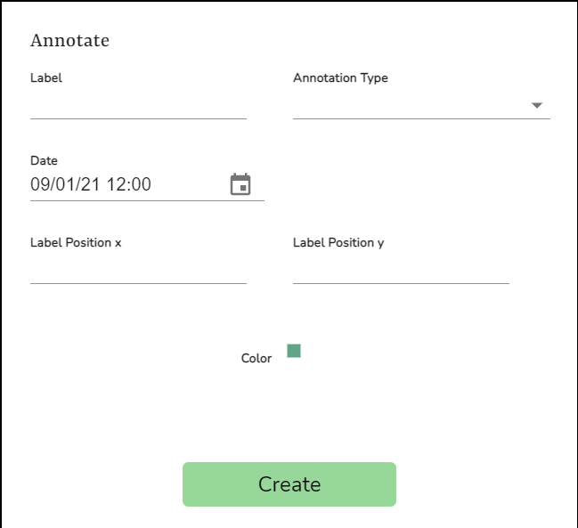

   

3. Enter the annotation label in the `Label` field.

4. Select your annotation type.

5. Select the date you would like your annotation on.

6. Enter the label position x value.

7. Enter the label position y value.

### Graph Details

To view a particular graph in greater detail, click on the graph. You will be redirected to a page that will let you view a graph in greater detail as well as edit that graph.

The following details can be viewed:

#### Graph

A bigger graph can be viewed and analyzed in greater detail.

Features of this include:

- Annotations display when graph is in range.
- Tooltips that display data when hovering over points.
- Dynamically updating graph fields and types.

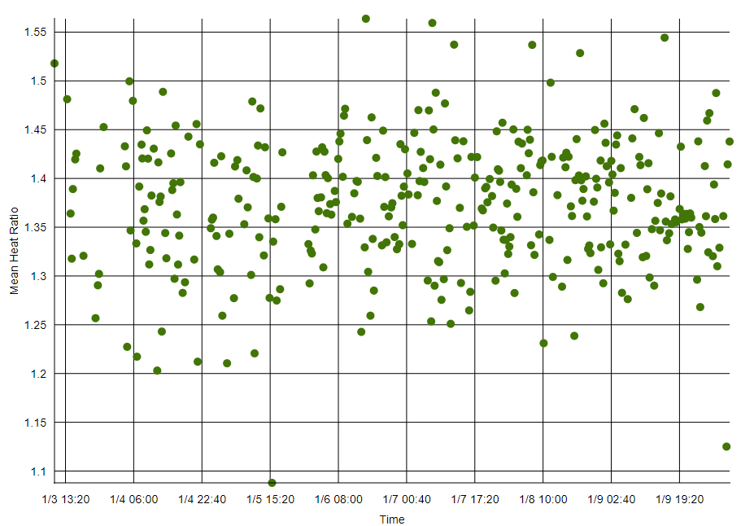

#### Node Info

Node info of the node(s) being used is displayed.

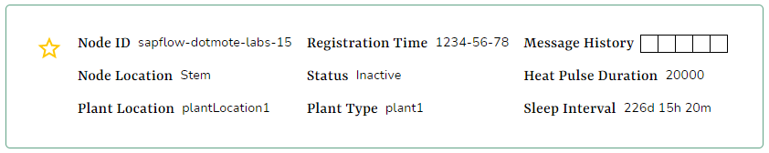

Information displayed includes:

- Node ID
- Registration time
- Message history
- Node location
- Plant location
- Plant Type
- Status
- Heat pulse duration
- Sleep interval

#### Raw Data

Raw data of the node(s)' sapflows is displayed.

Features of this include:

- Ability to switch between raw data of different nodes
- Export raw data to .csv

Information displayed includes:

- Date
- Timestamp
- Node ID
- Mean Heat Ratio
- Mean Outside Temperature
- Mean Soil Moisture
- Mean Outside Humidity

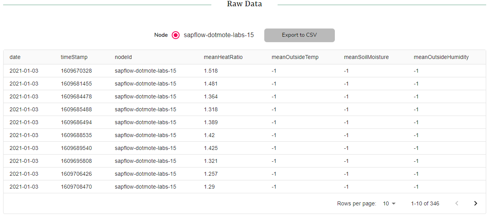

#### Annotations

Annotations made of the graph can be viewed.

Features of this include:

- Ability to switch between annotations of different nodes
- Export raw data to .csv

Information displayed includes:

- Graph id
- Label
- Annotation type
- From Timestamp
- To Timestamp
- Color

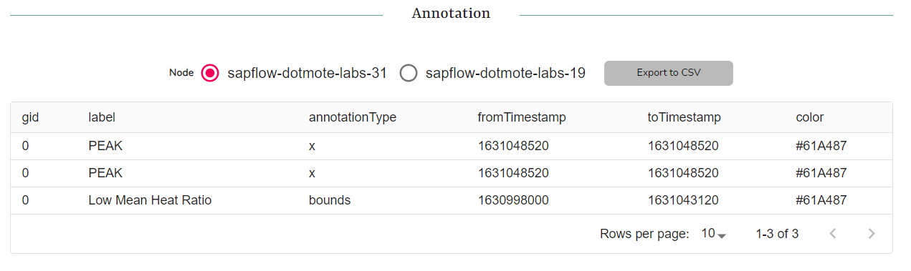

#### Edit History

If any property of the graph is changed, it will be documented in the edit history.

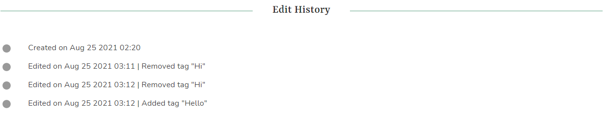

Information displayed includes:

- Created timestamp
- Edited timestamp with specific edit messages

### Favorite-ing a Graph

To favorite/un-favorite a graph, click the star icon next to the graph. Favorite graphs are indicated by a full yellow star icon. 

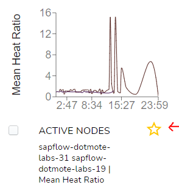

Alternatively, you can click on the graph. You will be redirected to a page that lets you view your graph in greater detail. You can can on the `Favorite` Button from there.

## Deleting a Graph

To delete a graph, select a graph on the graphs page and click on the `Delete` button next to the `Select All`.

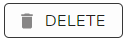

Alternatively, you can click on the graph. You will be redirected to a page that lets you view your graph in greater detail. You can can on the `Delete` Button from there.

